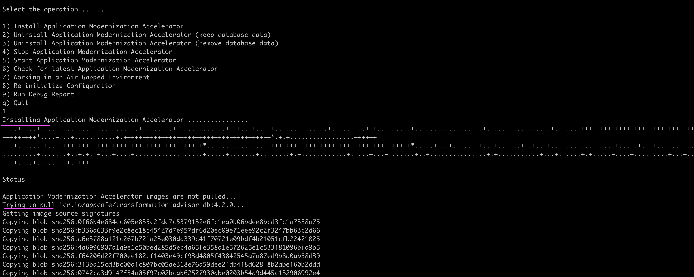
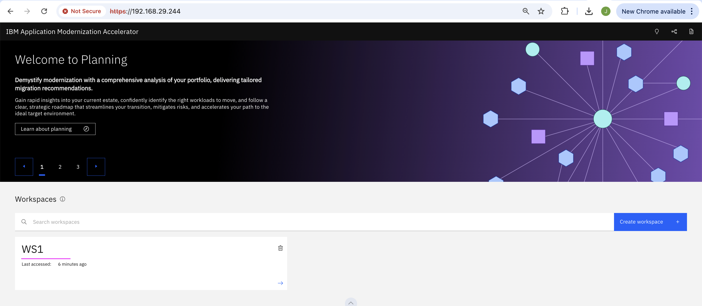

# IBM Application Modernization Accelerator (AMA) Installation

This documentation explains about AMA installation in detail.

## 1. Download AMA

1. Download the AMA binary from the URL https://www.ibm.com/support/pages/ibm-application-modernization-accelerator-downloads


2. Unzip the downloaded file application-modernization-accelerator-local-4.2.0.zip

3. Goto the unziped folder.

```
cd /Users/xxxxx/application-modernization-accelerator-local-4.2.0
```

## 2. Install

1. Run the below command to launch the installation

```
./launch.sh
```

2. Accept the license


3. Accept the Terms


4. Choose the Install AMA option (1)


It starts installing. At the end you will have URL to access the AMA.




## 3. Discovery

1. Run the below command to in the websphere for the discovery.


2. Accept the license


3. Note the file listed at the end of the discovery.


## 4. Upload the discovery results to the AMA




## 5. See the results.


