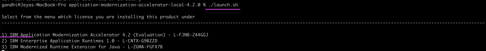
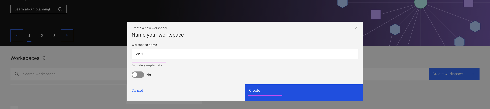

# IBM Application Modernization Accelerator (AMA) Installation

This documentation gives step by step instructions to install IBM Application Modernization Accelerator in Linux/MacOS.


## 1. Download AMA

1. Download the AMA binary from the URL https://www.ibm.com/support/pages/ibm-application-modernization-accelerator-downloads


2. Unzip the downloaded file `application-modernization-accelerator-local-4.2.0.zip`

3. Goto the unziped folder.

```
cd /Users/xxxxx/application-modernization-accelerator-local-4.2.0
```

## 2. Install

1. Run the below command to launch the installation

```
./launch.sh
```

2. Accept the license by entering `1`



3. Accept the Terms by entering `1`


4. Choose the  `1) Installing Application Modernization Accelerator`


It starts installing. At the end you will have URL to access the AMA.


## 3. Create Workspace 

1. Open the AMA console https://x.x.x.x:443

2. Click on `Create Workspace` 


3. Enter the workspace name

4. Click on  `Create`



Workspace get created as like this.


## 4. Download Discovery Tool

1. Open the workspace, by clicking on WS1 tile in the above screen.

You will get the below screen.  

2. Click on `Open discovery tool`


3. Select the `Source operating system`

4. Click on `Open discovery tool`


It will download the file `transformationadvisor-Linux_WS1.tgz` based on your selection.

## 5. Run Discovery in your source environment

To install the discovery tool, log on to your application server with the application owner’s user credentials and complete the following steps:

1. Copy the above `xxxx.tgz` file to to your application server

2. Untar the file

```
tar xvfz transformationadvisor-Linux_WS1.tgz
```

3. Goto the untarred folder.

```
cd /Users/xxxxx/transformationadvisorxxxxx
```

4. Run the below command in the websphere for the discovery.

```
 ./bin/transformationadvisor -w /opt/IBM/WebSphere/AppServer -p Profile01 --ignore-missing-binary --ignore-missing-shared-library --no-upload
```
Here 
- -w is WEBSPHERE_HOME_DIR
- -p is PROFILE_NAME


5. Accept the license


6. Note the file name `/root/install1/ama/transformationadvisor-4.2.0/Profile01.zip` listed at the end of the discovery.


## 6. Upload the discovery results to the AMA


## 7. See the results.


## Reference

Install
https://www.ibm.com/docs/en/ama?topic=install

Data Collector
https://www.ibm.com/docs/en/ama?topic=accelerator-using-data-collector
