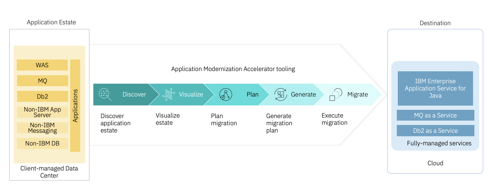
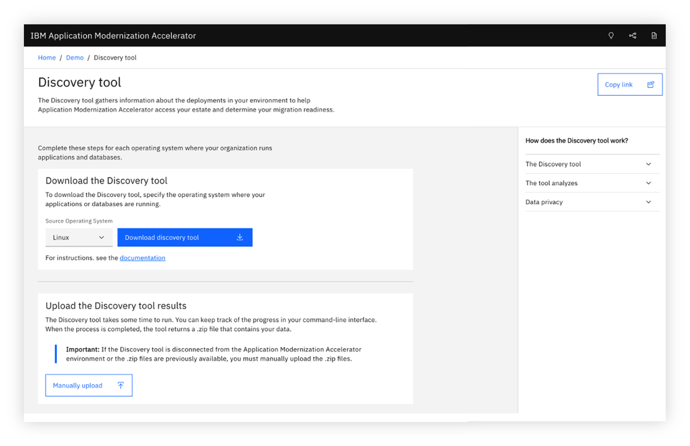
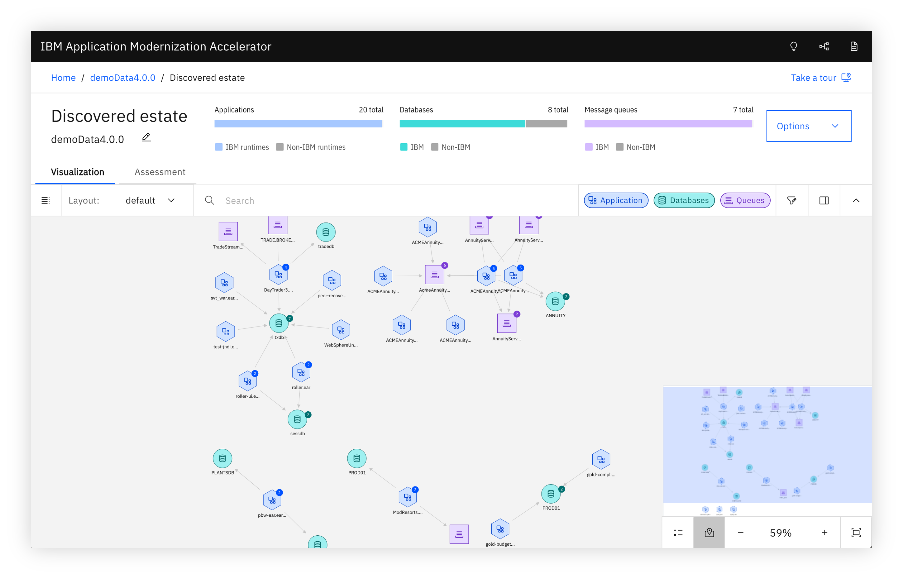
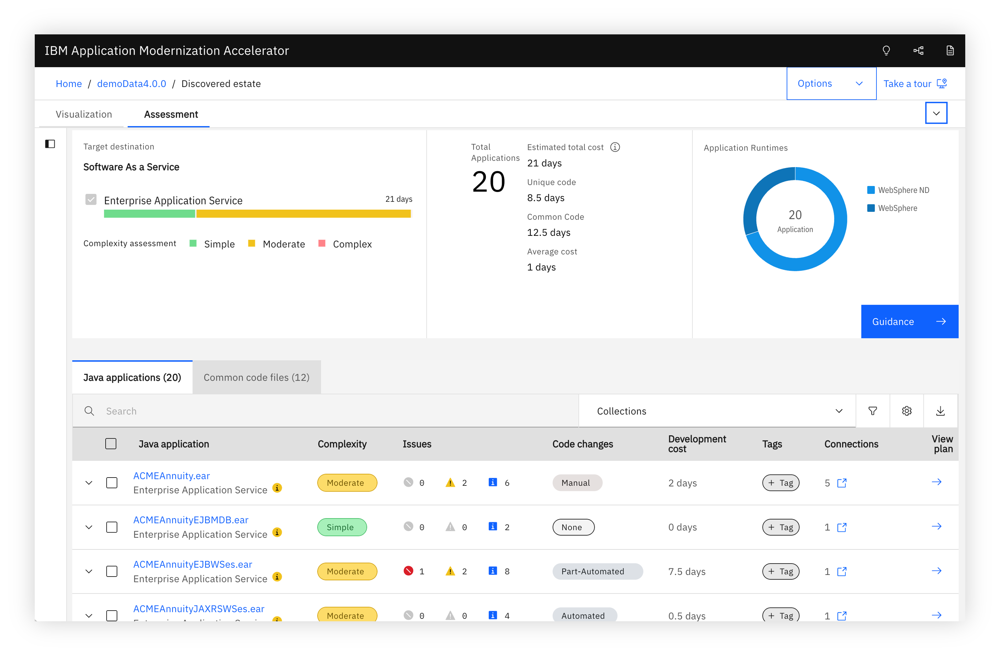
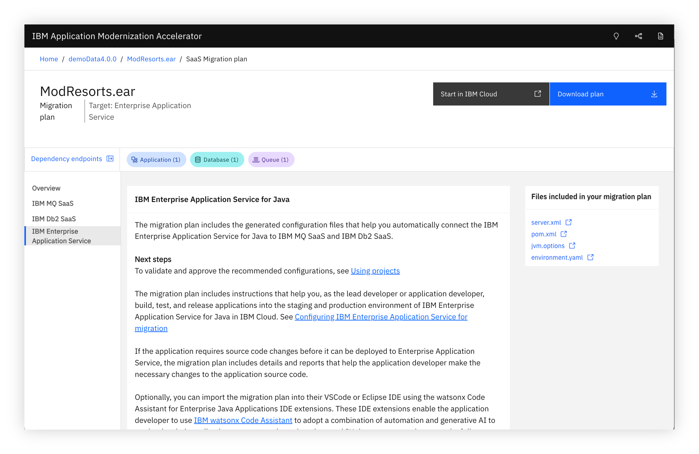
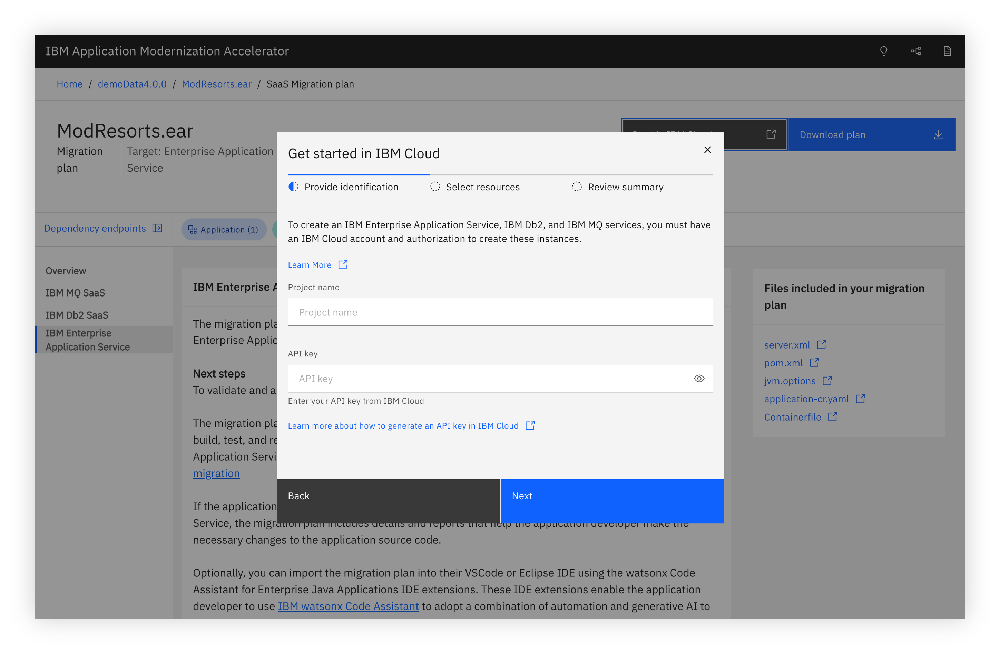
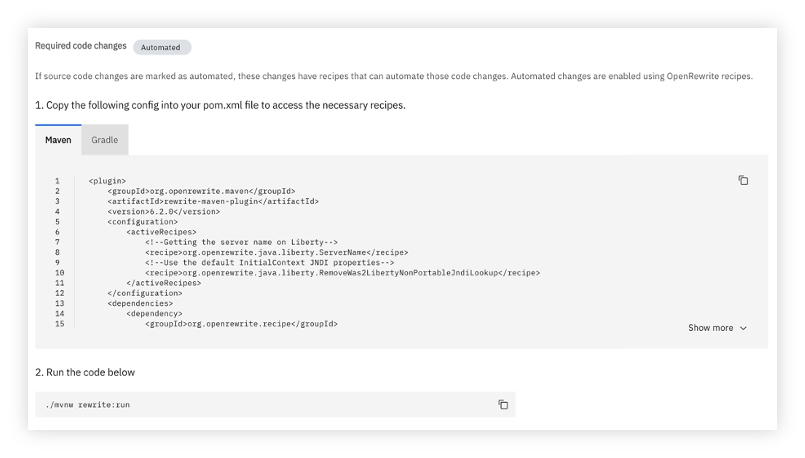

# IBM Application Modernization Accelerator (AMA) in EASeJ

This documentation explains about how the IBM Application Modernization Accelerator (AMA) looks in EASeJ (IBM Managed services) offering.

Application Modernization Accelerator (AMA) supports a five-phase approach to modernization. 

## 1. Discover

Scan your application environment, including WAS, MQ and Db2

## 2. Visualize

View the topology of your applications, MQ and DB.

## 3. Plan

Plan your migration based on the complexity and other factors.

## 4. Generate

Generate artifacts for the migration.

## 5. Migrate

Migrate MQ and Db2 to new cloud services using the generated Migration Plan

- Apply application code updates if any required.
- AMA offers a set of migration recipes designed to automate specific code migrations. 
- These recipes can be executed by copying the configuration into a Maven or Gradle file and initiating a build. 
- Alternatively, the migration plan can be imported into watsonx Code Assistant (WCA), which facilitates recipe execution. 
- For more complex code migrations and unit test generation, WCA’s generative AI capabilities provide additional support.

